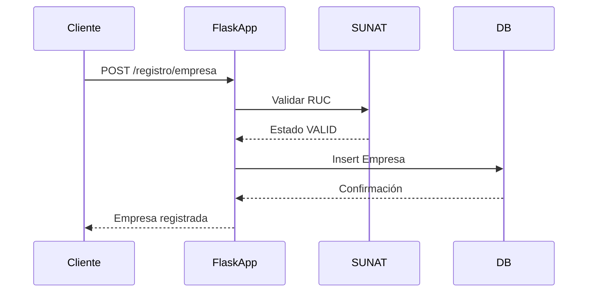
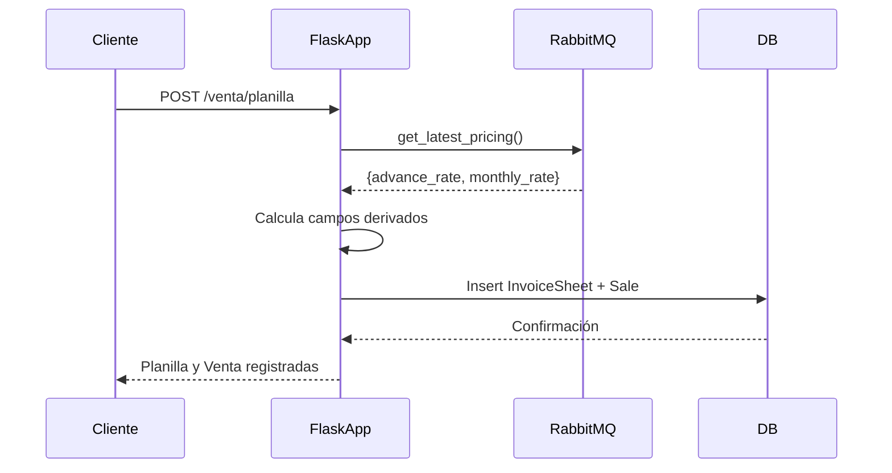
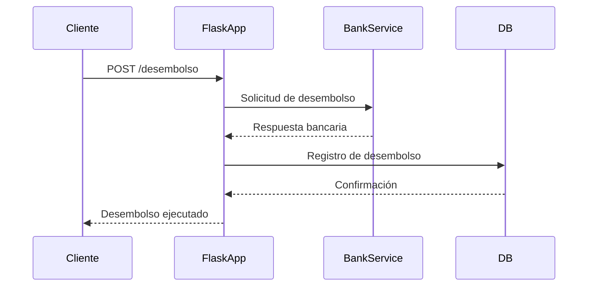
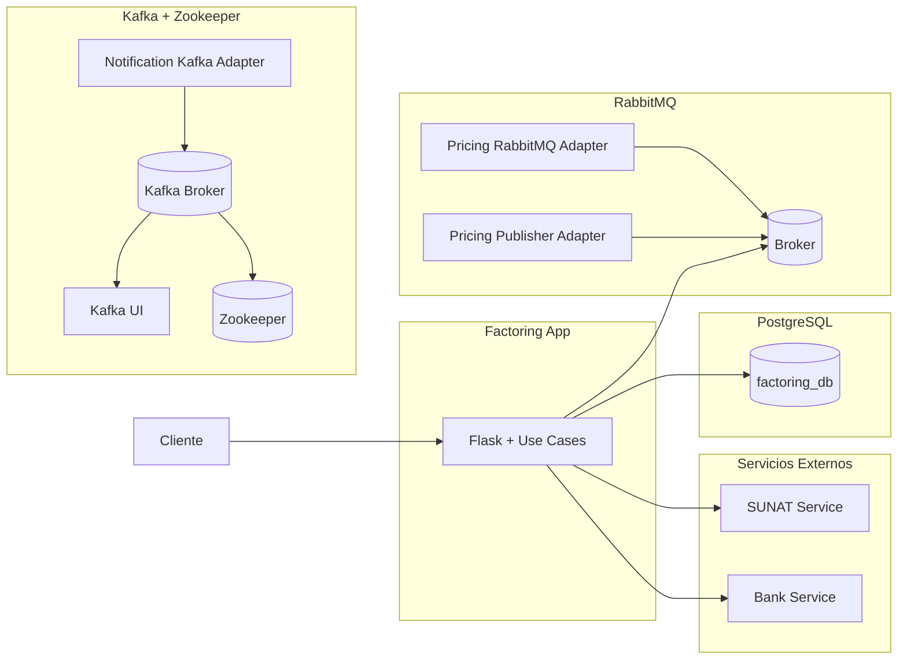

# 📘 Sistema de Factoring Distribuido

## 📑 Índice
1. [Descripción del Sistema](#descripción-del-sistema)  
2. [Casos de Uso](#casos-de-uso)  
   - Registro de Usuario  
   - Registro de Empresa  
   - Registro de Documentos  
   - Registro de Planilla (Venta)  
   - Ejecución de Desembolso  
3. [Infraestructura](#infraestructura)  
   - Arquitectura de Contenedores  
   - Base de Datos  
   - Servicios Externos  
   - Mensajería (RabbitMQ y Kafka)  
4. [Diagramas de Secuencia](#diagramas-de-secuencia)  
   - Caso de Uso: Registro  
   - Caso de Uso: Venta  
   - Caso de Uso: Desembolso  
5. [Uso de Kafka](#uso-de-kafka)  
6. [Uso de RabbitMQ](#uso-de-rabbitmq)  
7. [Diagrama de Arquitectura General](#diagrama-de-arquitectura-general)  

---

## 📖 Descripción del Sistema
El sistema de **Factoring** permite gestionar el registro de empresas, documentos y planillas de facturas, calcular tasas de adelanto (*pricing*) y ejecutar desembolsos.  
Está construido en **Python + Flask**, con **PostgreSQL** como base de datos, y utiliza **RabbitMQ** y **Kafka** para la mensajería distribuida.

---

## ⚙️ Casos de Uso

### 1. Registro de Usuario
- Endpoint: `/registro/usuario`  
- Permite registrar un usuario con sus credenciales y datos personales.

### 2. Registro de Empresa
- Endpoint: `/registro/empresa`  
- Valida el RUC con el servicio externo **SUNAT** antes de registrar la empresa.

### 3. Registro de Documentos
- Endpoint: `/registro/documento`  
- Permite asociar documentos a una empresa.

### 4. Registro de Planilla (Venta)
- Endpoint: `/venta/planilla`  
- Recupera tasas de **pricing** desde RabbitMQ.  
- Calcula automáticamente:
  - `advance_amount = total_amount - total_amount * advance_rate`  
  - `interest_fee = advance_amount * monthly_rate`  
  - `commission = total_amount * advance_rate`  
  - `net_disbursement = total_amount - interest_fee - commission`  
- Guarda la planilla en `invoice_sheets` y la venta en `sales`.

### 5. Ejecución de Desembolso
- Endpoint: `/desembolso`  
- Orquesta el desembolso con el servicio bancario externo.

---

## 🏗️ Infraestructura

### Arquitectura de Contenedores
El sistema se despliega con **Docker Compose**, incluyendo:
- `factoring_app`: núcleo Flask.  
- `db`: PostgreSQL.  
- `sunat_service`: validación de RUC.  
- `bank_service`: integración bancaria.  
- `rabbitmq`: broker de mensajería.  
- `pricing_rabbitmq_adapter`: consumidor de tasas de pricing.  
- `pricing_publisher_adapter`: productor de tasas de pricing.  
- `kafka` + `zookeeper`: mensajería distribuida.  
- `notification_kafka_adapter`: envío de notificaciones.  
- `kafka-ui`: interfaz de administración.

---

## 📊 Diagramas de Secuencia

### Caso de Uso: Registro

### Caso de Uso: Venta

### Caso de Uso: Desembolso

## 📡 Uso de Kafka
* Kafka se utiliza para notificaciones distribuidas.

* El contenedor notification_kafka_adapter publica mensajes en el tópico notifications.

* Esto permite que otros servicios (por ejemplo, monitoreo o auditoría) reciban eventos en tiempo real sobre operaciones de factoring.

## 📨 Uso de RabbitMQ
* RabbitMQ se utiliza para gestionar las tasas de pricing.

* El contenedor pricing_publisher_adapter publica mensajes en la cola pricing_queue con las tasas (advance_rate, monthly_rate).

* El contenedor pricing_rabbitmq_adapter consume estos mensajes y expone el último pricing disponible.

* El caso de uso RegistrarPlanillaUseCase consulta esta cola para calcular los valores financieros de cada plani

---

## 🗂️ Diagrama de Arquitectura General
