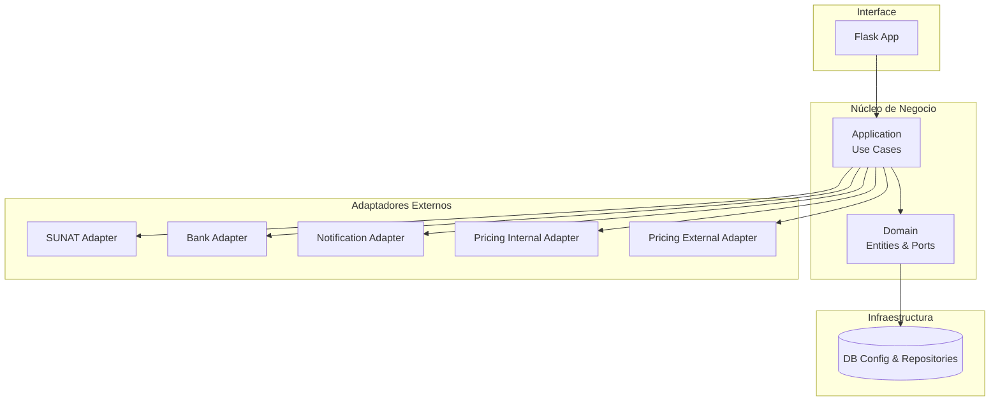
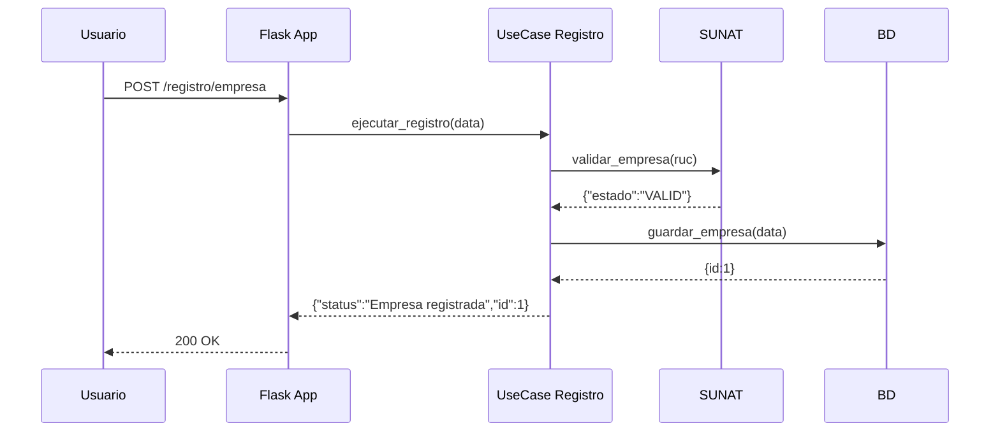
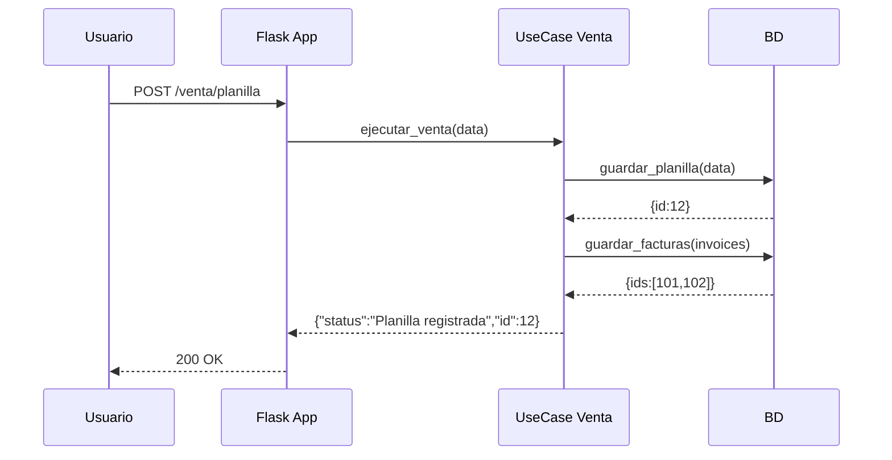
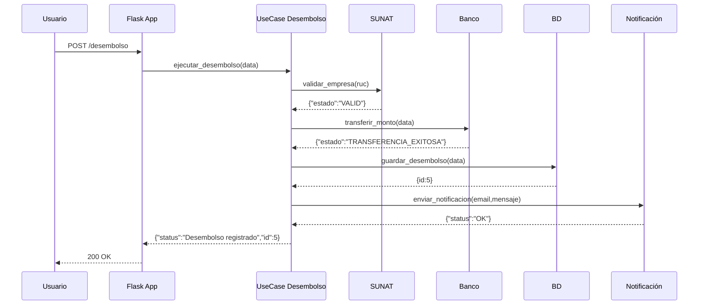

# 📘 Proyecto Factoring Hexagonal

## 📑 Índice
- [📌 Explicación del Sistema de Factoring](#-explicación-del-sistema-de-factoring)
- [⚙️ Casos de Uso](#️-casos-de-uso)
- [🔌 Puertos](#-puertos)
- [🧩 Adaptadores](#-adaptadores)
- [🏗️ Infraestructura](#️-infraestructura)
- [🗄️ Modelo de Datos](#️-modelo-de-datos)
- [🧱 Diagrama de Capas Hexagonal](#-diagrama-de-capas-hexagonal)
- [🔄 Diagramas de Secuencia](#-diagramas-de-secuencia)
  - [Registro](#registro)
  - [Venta](#venta)
  - [Desembolso](#desembolso)
- [🐳 Explicación de Docker Compose](#-explicación-de-docker-compose)
- [📂 Estructura del Proyecto](#-estructura-del-proyecto)
- [🧭 Sustento de Arquitectura Hexagonal](#-sustento-de-arquitectura-hexagonal)
- [▶️ Comandos para Iniciar la aplicación](#️-comandos-para-iniciar-la-aplicación)
- [🧪 Ejemplo de CURL](#-ejemplo-de-curl)

---

## 📌 Explicación del Sistema de Factoring
El sistema de **Factoring** permite a las empresas vender sus facturas a una entidad financiera para obtener liquidez inmediata.  
Este proyecto implementa un sistema de Factoring siguiendo la **Arquitectura Hexagonal**, asegurando separación de responsabilidades, flexibilidad en adaptadores y mantenibilidad.

---

## ⚙️ Casos de Uso
1. **Registro** → Usuarios, empresas y documentos.  
2. **Venta (Planilla con Facturas)** → Registro de planillas e inserción de facturas.  
3. **Desembolso** → Validación SUNAT, transferencia bancaria y notificación.

---

## 🔌 Puertos
Definidos en `factoring_app/domain/ports.py`:
- `PricingPort`  
- `BankPort`  
- `NotificationPort`  
- `SunatPort`  

---

## 🧩 Adaptadores
- **SUNAT Adapter** → `sunat_adapter/sunat_service.py`  
- **Bank Adapter** → `bank_adapter/bank_service.py`  
- **Notification Adapter** → `notification_adapter/notification_service.py`  
- **Pricing Internal Adapter** → `pricing_internal_adapter/internal_pricing_service.py`  
- **Pricing External Adapter** → `pricing_external_adapter/external_pricing_service.py`  

---

## 🏗️ Infraestructura
- `db_config.py` → Configuración SQLAlchemy.  
- `repositories.py` → Persistencia.  
- `external_services.py` → Integraciones externas.  
- `notifications.py` → Notificaciones.  
- `bank_services.py` → Servicios bancarios.  

---

## 🗄️ Modelo de Datos
- `User`  
- `Company`  
- `CompanyDocument`  
- `InvoiceSheet`  
- `Invoice`  
- `Disbursement`  

---

## 🧱 Diagrama de Capas Hexagonal


## 🔄 Diagramas de Secuencia
### Registro

### Venta

### Desembolso


## 🐳 Explicación de Docker Compose
* Define servicios: factoring_app, sunat_service, bank_service, notification_service, pricing_internal_service, pricing_external_service.

* Cada servicio tiene su propio Dockerfile.

* La red interna permite comunicación entre contenedores.

## 📂 Estructura del Proyecto
```Código
factoring_project/
│   docker-compose.yml
│   requirements.txt
├── factoring_app/
│   ├── domain/
│   ├── application/
│   ├── infrastructure/
│   └── interface/
├── sunat_adapter/
├── bank_adapter/
├── notification_adapter/
├── pricing_internal_adapter/
└── pricing_external_adapter/
```

## 🧭 Sustento de Arquitectura Hexagonal
* Independencia tecnológica: el núcleo no depende de frameworks ni servicios externos.

* Flexibilidad: adaptadores pueden cambiarse sin modificar el dominio.

* Testabilidad: casos de uso pueden probarse con adaptadores simulados.

## ▶️ Comandos para Iniciar la aplicación
```bash
# Construir imágenes
docker-compose build --no-cache

# Levantar servicios
docker-compose up -d

# Ver logs
docker-compose logs -f factoring_app
```

## 🧪 Ejemplo de CURL
### Registro Empresa
```bash
curl --location 'http://localhost:5000/registro/empresa' \
--header 'Content-Type: application/json' \
--data '{"ruc":"20123456789","razon_social":"Empresa SAC"}'
```

### Venta Planilla
```bash
curl --location 'http://localhost:5000/venta/planilla' \
--header 'Content-Type: application/json' \
--data '{
  "company_id":1,
  "sheet_code":"PLAN001",
  "currency":"PEN",
  "total_amount":10000,
  "advance_amount":8000,
  "interest_fee":200,
  "commission":100,
  "net_disbursement":7700,
  "invoices":[
    {"invoice_number":"F001-0001","drawer_ruc":"20123456789","debtor_ruc":"10456789012","debtor_name":"Cliente SAC","amount":5000,"currency":"PEN","issue_date":"2026-07-01","due_date":"2026-08-01","days_to_maturity":30}
  ]
}'
```

### Desembolso
```bash
curl --location 'http://localhost:5000/desembolso' \
--header 'Content-Type: application/json' \
--data '{
  "ruc":"20123456789",
  "sheet_id":12,
  "annotation_code":"ANOT001",
  "amount":8000,
  "currency":"PEN",
  "bank_name":"Banco de Crédito",
  "bank_account_number":"1234567890",
  "cci":"00212345678901234567",
  "destinatario":"cliente@example.com"
}'
```
